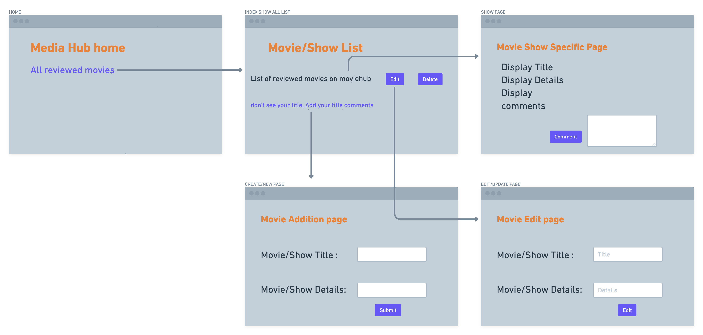
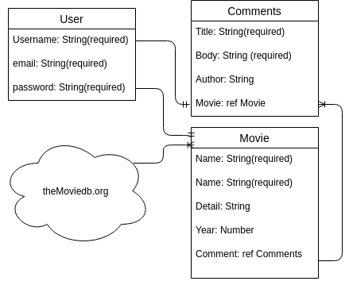

# Media Hub

# Technology Used

###     1. JavaScript
###     2. HTML
###     3. CSS, Bootstrap
###     4. EJS
###     5. Github
###     6. Node and modules: express, Mongoose, bcryptjs

# User Stories

## Home page (*authentication*):

Movie Hub is an app which allows users to add the movie title along with release year and story details once *registered and logged in*.

Register link will take the user to the page where they can input required name(*5 characters or more*), email and password(*5 characters or more*). 

Once user registered and logged in they will remain logged in for a week unless log out.

## Adding a movie title:

Add New Title allows user to add a movie title to our database. 

## Movie index page:

Once title is entered, API feed is fetched and scanned for a title match to import movie image, details and release year if found.

If there is no title match for user input new movie details will populate based on given user data with no image.

At this point new movie will be displayed on index page, which user can edit and delete movie information as title, details and the year from index page.

## Movie Show page:

Movie show page includes title, year, image and details of that individual movie.
User can also add new comment on that movie or view the list of previous comments besides having the option to delete and edit comments for that specific movie. 

# Wireframe 

# Entity Relationship Diagram (ERD)

# Stretch Goals 

- Heroku deployment

- Alphabetical sorting of the movie list.

- Add TV DB series besides movies.

- Add user list of added movies and comments.

- Enable movie/comment details editing/deleting for creating user only.

- Notify created user via email when new comment has posted on their added media.

- Create a review scoring system using number of likes/stars/numbers.